# Presentime

A presentation timer that helps speakers stay on track. Define sections with time budgets, then run a live timer that shows exactly where you stand — section by section.


## Why Presentime?

Most presentation timers give you a single countdown. That's fine until you're 3 minutes over on slide 4 and have no idea if you can still fit the demo. Presentime tracks each section independently, redistributes overtime across remaining sections, and shows planned vs actual time so you always know where you stand.

## Walkthrough

### 1. Getting Started

Click **Load Sample Presentation** to load a built-in example, or hit **+ New Presentation** to create your own. The **Import** button lets you load a presentation someone has shared with you.

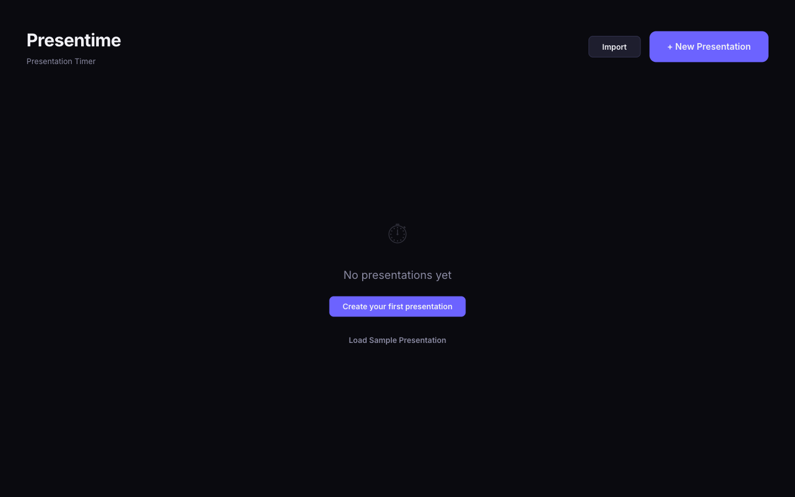

### 2. Build Your Agenda

Give each section a name and a time budget in MM:SS format. Drag the handles to reorder sections. The header shows the total duration across all sections.

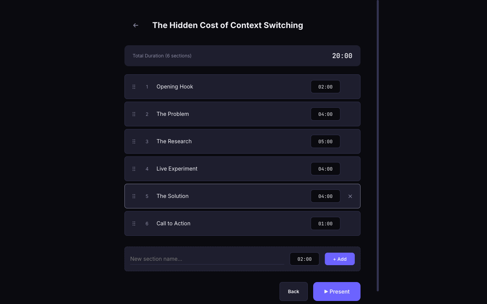

### 3. Run Your Presentation

Click **Present** to launch the live timer. Dual countdown rings show overall progress and current section time. The sidebar lists every section with its planned duration. Press **Space** to pause, **Right Arrow** to complete the current section and advance, or **Esc** to exit.

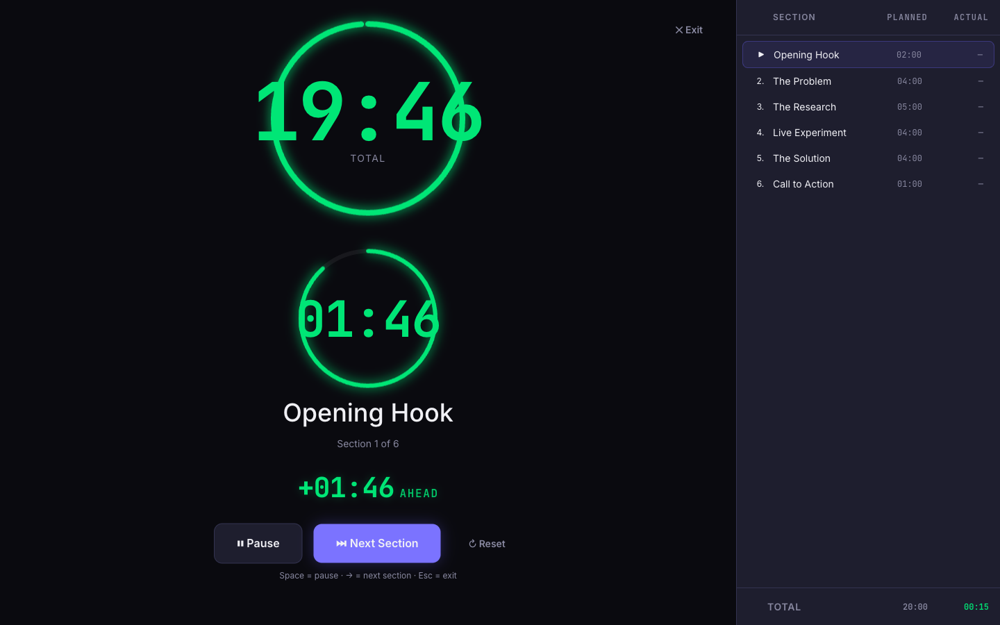

### 4. Track Your Pace

As you complete sections, the pace indicator tells you exactly how far ahead or behind schedule you are. Sections finished under budget show green actual times; over budget shows red. The screen flashes yellow at 25% remaining and red at 10%.

| Ahead of schedule | Behind schedule |
|:-:|:-:|
| 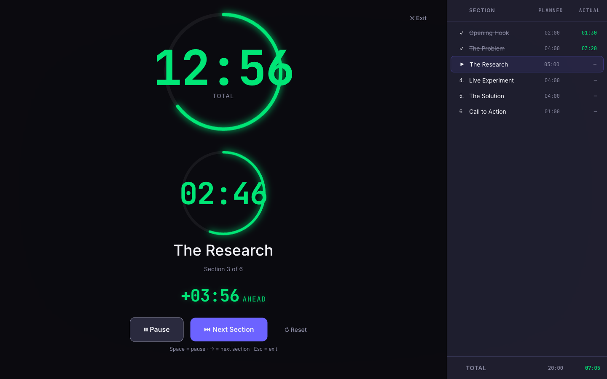 | 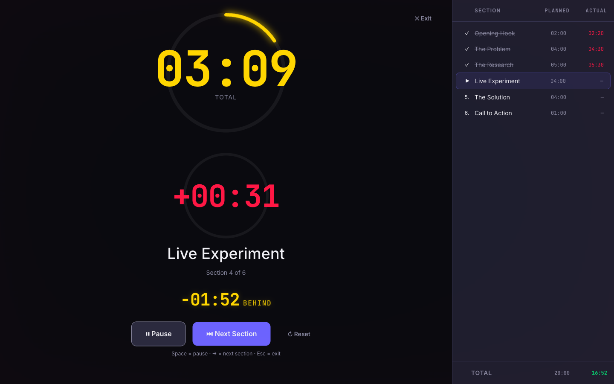 |

### 5. Running Totals

The sidebar footer keeps a running total of planned vs actual time so you can see at a glance how your overall timing compares to the plan.

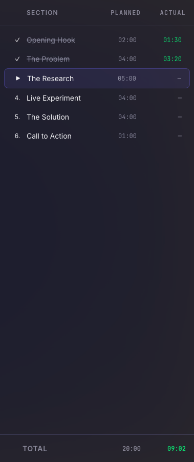

### 6. Manage Your Presentations

All your presentations live on the home screen. Each card shows section count and total duration. Use the action buttons to:

- **Export** (↓) — Download as a shareable `.json` file
- **Duplicate** (⧉) — Copy a presentation as a starting point
- **Delete** (✕) — Remove a presentation

Share a `.json` file with a colleague and they can **Import** it using the button in the header.

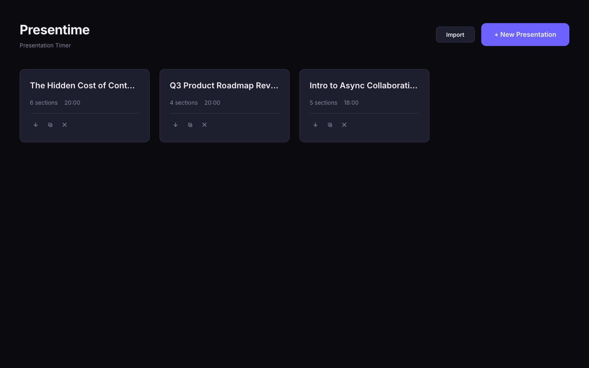

## Presenter Themes

Click the palette icon in the top-left corner of the presenter view to switch themes. Your selection persists across sessions via localStorage.

| Theme | Preview |
|-------|---------|
| **Default** — Dark background, purple accent, stacked rings | 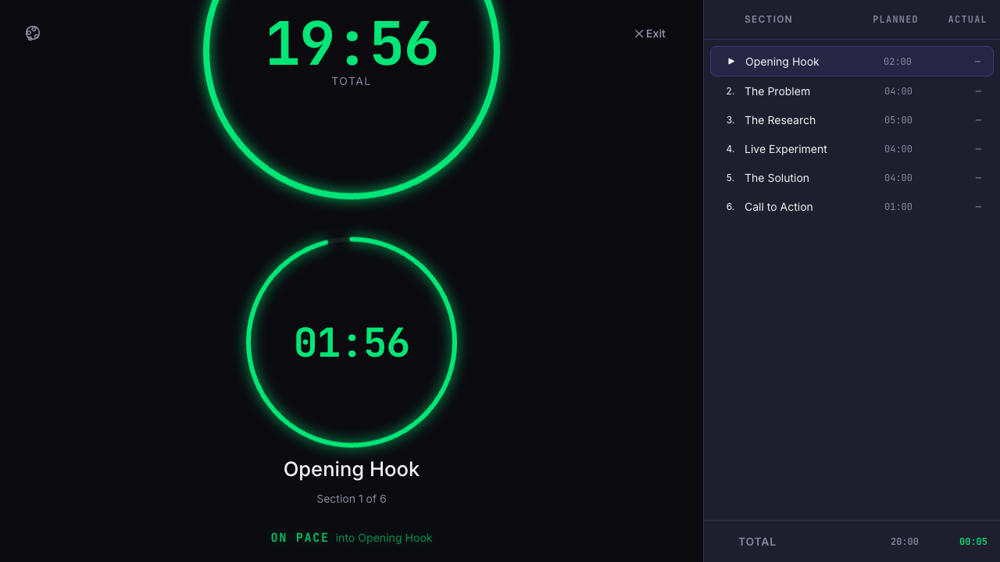 |
| **Compact** — Side-by-side rings with labels inside, larger fonts | 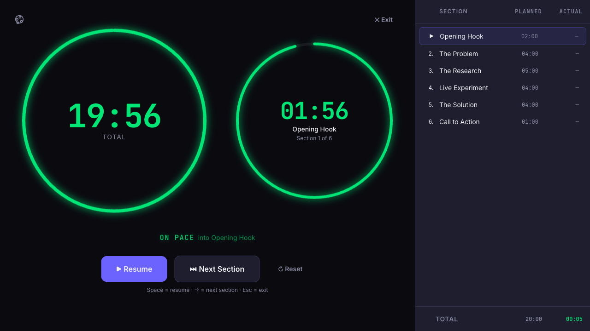 |
| **High Contrast** — Pure black, bold strokes, larger rings for distance readability | 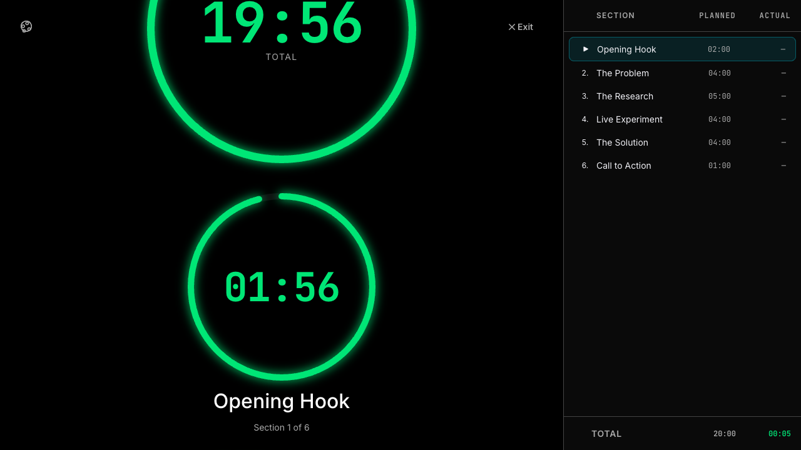 |
| **Retro Terminal** — Green-on-black CRT aesthetic with phosphor glow and scanlines | 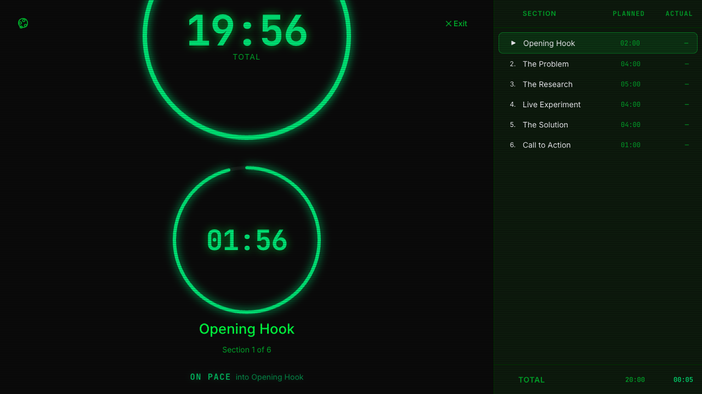 |
| **Minimal Light** — Light background, thin strokes, indigo accent | 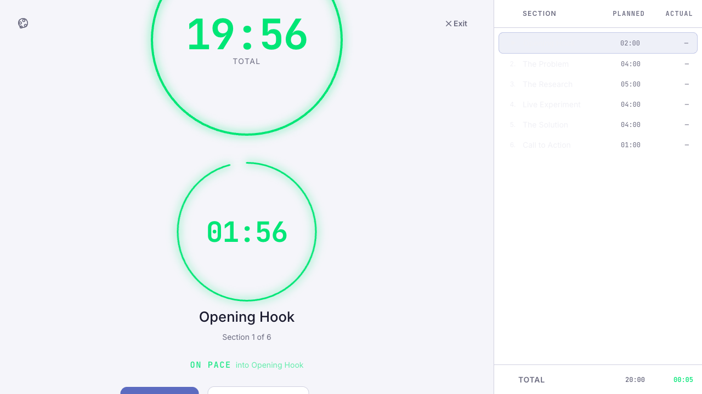 |

Each theme customizes colors, ring sizes, stroke weights, typography, and layout direction. Warning colors (green/yellow/red) stay constant across all themes for consistency.

## Time Warnings

As section or overall timers run low, colors shift automatically:

| State | Color | Trigger |
|-------|-------|---------|
| OK | Green (`#00E676`) | > 25% remaining |
| Caution | Yellow (`#FFD600`) | < 25% remaining |
| Danger | Red (`#FF1744`) | < 10% remaining |
| Overtime | Red (flashing) | Timer exceeded |

The screen overlay flashes at the same thresholds, with increasing urgency. Warning colors are consistent across all themes.

## Smart Time Redistribution

Presentime dynamically adjusts section budgets so you always know where you stand:

- **Overrun a section?** Remaining sections shrink proportionally to absorb the deficit. A minimum floor (15s) prevents any section from being eliminated entirely.
- **Finish early or skip a section?** Saved time flows back to remaining sections, restoring them toward their original budgets proportionally based on how much each was previously reduced.

The **pace indicator** always measures against the *original* plan — redistribution never masks how far ahead or behind you truly are. A 2-second dead zone around zero displays "ON PACE" to prevent jitter, and the current section name is shown for context (e.g. `-01:33 BEHIND into The Problem`).

## Features

- **Section-based timing** — Break your talk into named sections, each with its own time budget
- **Live presenter view** — Dual countdown rings for overall and current section, with the section name and index always visible
- **Planned vs Actual sidebar** — Every section shows its planned duration and actual time once completed, with a running total footer
- **Pace indicator** — Real-time `+MM:SS AHEAD` or `-MM:SS BEHIND` display measured against the original plan, with section context (e.g. "into The Problem")
- **Smart time redistribution** — Overruns compress remaining sections; early finishes and skips restore time back toward original budgets
- **5 presenter themes** — Switch visual styles on the fly via the palette icon; your choice persists to localStorage
- **Warning overlays** — Screen flashes yellow at 25% remaining, red at 10%, and pulses when overtime
- **Drag-and-drop reordering** — Rearrange sections in the editor by dragging
- **Keyboard shortcuts** — Space to play/pause, Right Arrow to advance, Esc to exit
- **Screen wake lock** — Display stays on during your presentation
- **Import/export** — Export any presentation to a human-readable JSON file, import it on another device or share it with others
- **Built-in sample** — One-click sample presentation so new users can see the format and jump right in
- **Offline & local** — Everything runs in the browser. Presentations persist in localStorage

## Quick Start

```bash
git clone https://github.com/geseib/presentime.git
cd presentime
npm install
npm run dev
```

Open [http://localhost:5173](http://localhost:5173) in your browser.

### Requirements

- Node.js 18+
- npm 9+

## Import & Export Format

Export any presentation as a `.json` file using the download button (↓) on its card. The format is human-readable:

```json
{
  "name": "The Hidden Cost of Context Switching",
  "sections": [
    { "name": "Opening Hook", "duration": "02:00" },
    { "name": "The Problem", "duration": "04:00" },
    { "name": "The Research", "duration": "05:00" },
    { "name": "Live Experiment", "duration": "04:00" },
    { "name": "The Solution", "duration": "04:00" },
    { "name": "Call to Action", "duration": "01:00" }
  ]
}
```

Import a `.json` file using the **Import** button in the header. Invalid files show a descriptive error message.

## Scripts

| Command | Description |
|---------|-------------|
| `npm run dev` | Start dev server with hot reload |
| `npm run build` | Type-check and build for production |
| `npm run preview` | Preview the production build locally |
| `npm run lint` | Run ESLint |

## Tech Stack

| Layer | Technology |
|-------|------------|
| Framework | React 19 |
| Language | TypeScript 5.8 |
| Build | Vite 6 |
| State | Zustand 5 (with localStorage persistence) |
| Styling | CSS Modules + CSS Custom Properties |
| Drag & Drop | dnd-kit |
| Animation | Motion |

## Project Structure

```
src/
├── components/
│   ├── editor/       # Presentation editing (sections, durations, reorder)
│   ├── manager/      # Home screen (create, list, delete presentations)
│   ├── presenter/    # Live timer view (timers, controls, section list, themes)
│   └── shared/       # Reusable UI (Button, ProgressArc, WarningOverlay)
├── hooks/            # useCountdown, useWakeLock, useWarningState
├── store/            # Zustand stores (presentationStore, timerStore, themeStore)
├── styles/           # Global CSS, design tokens, fonts
├── types/            # TypeScript type definitions
├── data/             # Built-in sample presentation
├── utils/            # formatTime, parseDuration, importExport, redistributionEngine
├── App.tsx           # Top-level view router
└── main.tsx          # Entry point
```

The app has three modes managed by `presentationStore`:

- **Manager** — List and create presentations
- **Editor** — Configure sections and durations for a presentation
- **Presenter** — Run the live timer

Timer state lives in `timerStore` and is initialized fresh each time you enter presenter mode. Presentation data is persisted to localStorage via Zustand's `persist` middleware.

## Contributing

Contributions are welcome. Here's how to get started:

1. Fork the repo and create a branch from `main`
2. Install dependencies: `npm install`
3. Start the dev server: `npm run dev`
4. Make your changes
5. Ensure the build passes: `npm run build`
6. Ensure linting passes: `npm run lint`
7. Open a pull request

### Guidelines

- **Keep it simple** — This is a focused tool. Features should serve the core use case of timing presentations
- **Follow existing patterns** — Use CSS Modules for styling, Zustand for state, and the existing component structure
- **Type everything** — No `any` types. All props and state should be fully typed
- **Test your changes** — Run through the full flow (create presentation, add sections, run timer, complete sections) before submitting

### Areas for Contribution

- Accessibility improvements (screen reader support, ARIA labels)
- Presentation history and analytics
- Mobile-responsive presenter view
- Test coverage (unit and E2E)

## License

MIT
