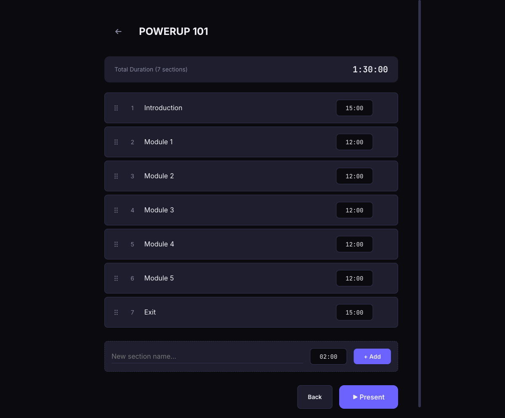
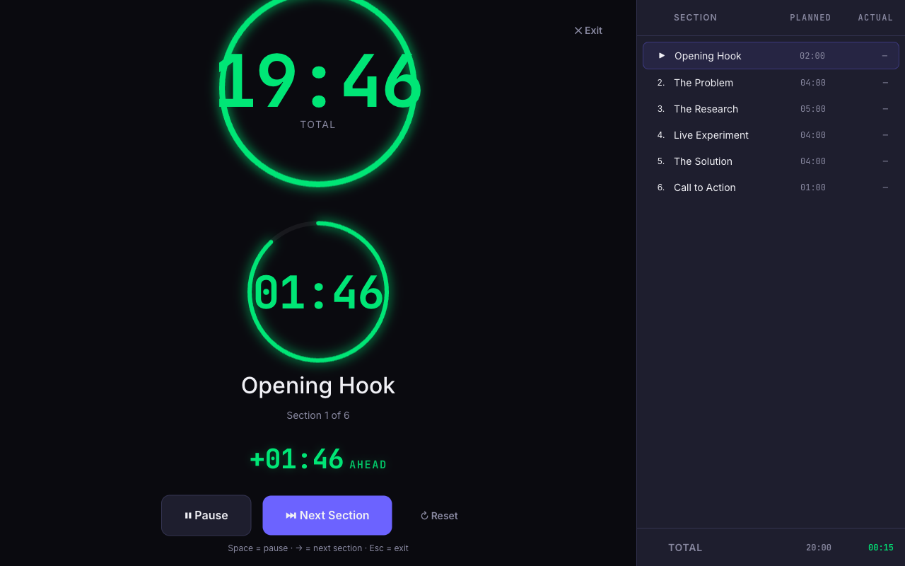
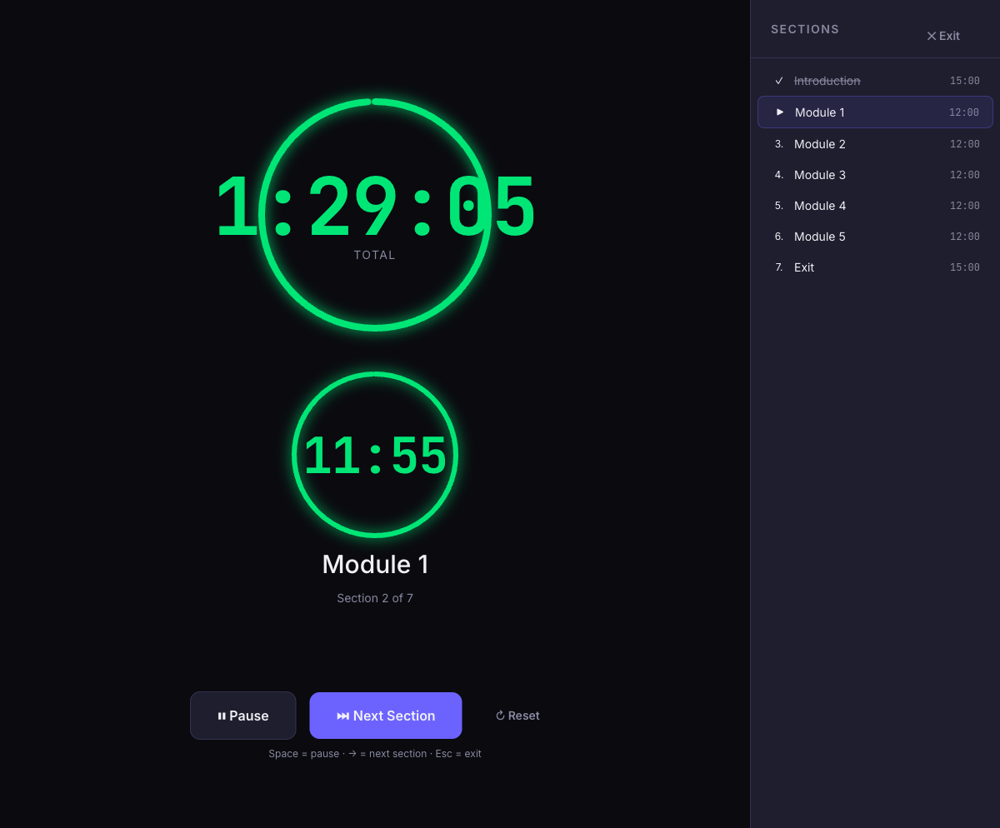
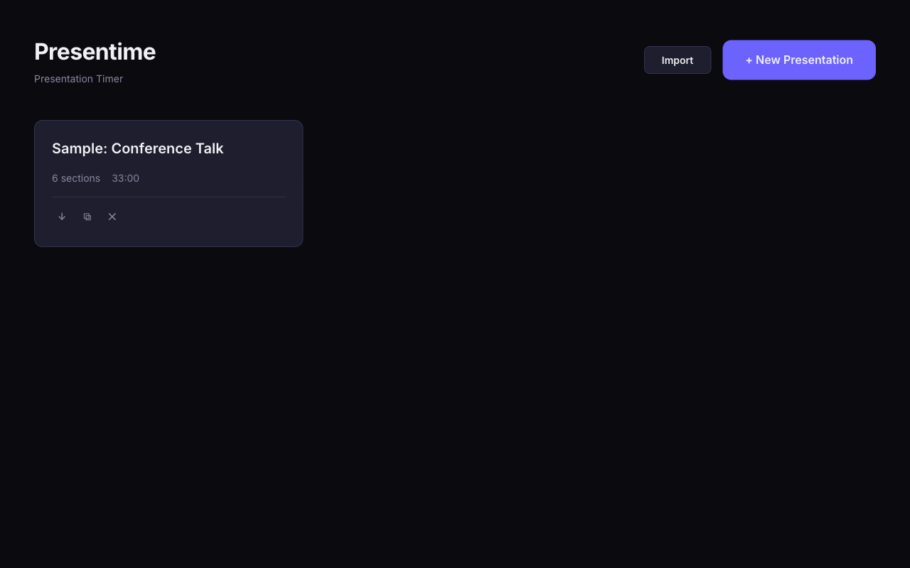
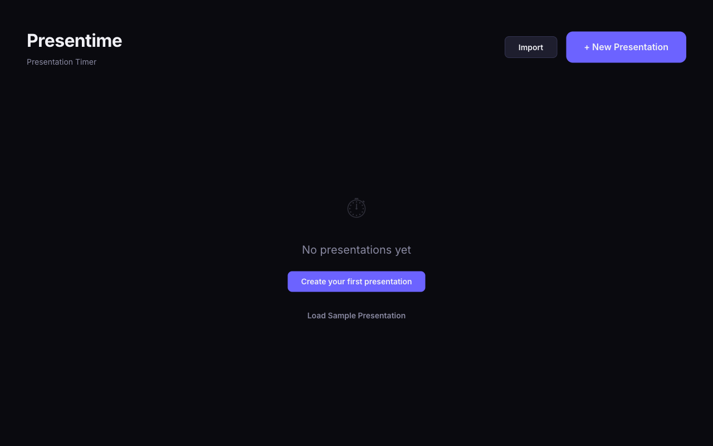

# Presentime

A presentation timer that helps speakers stay on track. Define sections with time budgets, then run a live timer that shows exactly where you stand — section by section.


## Screenshots

### Editor — Build your section lineup


### Presenter — Live countdown with section tracking


### Progress — Planned vs actual as you advance


### Manager — Import, export, and load samples


### Empty State — Get started quickly with a sample


## Why Presentime?

Most presentation timers give you a single countdown. That's fine until you're 3 minutes over on slide 4 and have no idea if you can still fit the demo. Presentime tracks each section independently, redistributes overtime across remaining sections, and shows planned vs actual time so you always know where you stand.

## Features

- **Section-based timing** — Break your talk into named sections, each with its own time budget
- **Live presenter view** — Large, readable timers for overall and current section countdowns
- **Overtime redistribution** — Go over on one section and remaining sections automatically adjust (with a 15-second floor so nothing disappears)
- **Planned vs Actual tracking** — Completed sections show both planned and actual time, color-coded green (under budget) or red (over)
- **Pace indicator** — Visual gauge showing if you're ahead, on track, or behind
- **Warning overlays** — Screen flashes yellow at 25% remaining, red at 10%, and pulses when overtime
- **Drag-and-drop reordering** — Rearrange sections in the editor by dragging
- **Keyboard shortcuts** — Space to play/pause, Right Arrow to advance, Esc to exit
- **Screen wake lock** — Display stays on during your presentation
- **Import/export** — Export any presentation to a human-readable JSON file, import it on another device or share it with others
- **Built-in sample** — One-click sample presentation so new users can see the format and jump right in
- **Offline & local** — Everything runs in the browser. Presentations persist in localStorage

## Quick Start

```bash
git clone https://github.com/geseib/presentime.git
cd presentime
npm install
npm run dev
```

Open [http://localhost:5173](http://localhost:5173) in your browser.

### Requirements

- Node.js 18+
- npm 9+

## Usage

1. **Create a presentation** — Click "New Presentation" on the home screen
2. **Add sections** — Give each section a name and duration (MM:SS format)
3. **Reorder** — Drag sections to rearrange the order
4. **Present** — Click "Start Presentation" to enter the presenter view
5. **Control the timer** — Space to play/pause, Right Arrow to complete the current section and advance

The sidebar tracks every section with its status, planned time, and actual time once completed. The footer shows your running total.

### Import & Export

Export any presentation as a `.json` file using the download button (↓) on its card. The format is human-readable:

```json
{
  "name": "Sample: Conference Talk",
  "sections": [
    { "name": "Introduction", "duration": "03:00" },
    { "name": "Problem Statement", "duration": "05:00" },
    { "name": "Proposed Solution", "duration": "10:00" },
    { "name": "Live Demo", "duration": "08:00" },
    { "name": "Q&A", "duration": "05:00" },
    { "name": "Wrap-up", "duration": "02:00" }
  ]
}
```

Import a `.json` file using the **Import** button in the header. Invalid files show a descriptive error message. New users can click **Load Sample Presentation** on the empty state to get started immediately.

## Scripts

| Command | Description |
|---------|-------------|
| `npm run dev` | Start dev server with hot reload |
| `npm run build` | Type-check and build for production |
| `npm run preview` | Preview the production build locally |
| `npm run lint` | Run ESLint |

## Tech Stack

| Layer | Technology |
|-------|------------|
| Framework | React 19 |
| Language | TypeScript 5.8 |
| Build | Vite 6 |
| State | Zustand 5 (with localStorage persistence) |
| Styling | CSS Modules + CSS Custom Properties |
| Drag & Drop | dnd-kit |
| Animation | Motion |

## Project Structure

```
src/
├── components/
│   ├── editor/       # Presentation editing (sections, durations, reorder)
│   ├── manager/      # Home screen (create, list, delete presentations)
│   ├── presenter/    # Live timer view (timers, controls, section list)
│   └── shared/       # Reusable UI (Button, WarningOverlay)
├── hooks/            # useCountdown, useWakeLock, useWarningState
├── store/            # Zustand stores (presentationStore, timerStore)
├── styles/           # Global CSS, design tokens, fonts
├── types/            # TypeScript type definitions
├── data/             # Built-in sample presentation
├── utils/            # formatTime, parseDuration, importExport, redistributionEngine
├── App.tsx           # Top-level view router
└── main.tsx          # Entry point
```

The app has three modes managed by `presentationStore`:

- **Manager** — List and create presentations
- **Editor** — Configure sections and durations for a presentation
- **Presenter** — Run the live timer

Timer state lives in `timerStore` and is initialized fresh each time you enter presenter mode. Presentation data is persisted to localStorage via Zustand's `persist` middleware.

## Contributing

Contributions are welcome. Here's how to get started:

1. Fork the repo and create a branch from `main`
2. Install dependencies: `npm install`
3. Start the dev server: `npm run dev`
4. Make your changes
5. Ensure the build passes: `npm run build`
6. Ensure linting passes: `npm run lint`
7. Open a pull request

### Guidelines

- **Keep it simple** — This is a focused tool. Features should serve the core use case of timing presentations
- **Follow existing patterns** — Use CSS Modules for styling, Zustand for state, and the existing component structure
- **Type everything** — No `any` types. All props and state should be fully typed
- **Test your changes** — Run through the full flow (create presentation, add sections, run timer, complete sections) before submitting

### Areas for Contribution

- Accessibility improvements (screen reader support, ARIA labels)
- Presentation history and analytics
- Mobile-responsive presenter view
- Test coverage (unit and E2E)
- Themes and customization

## License

MIT
